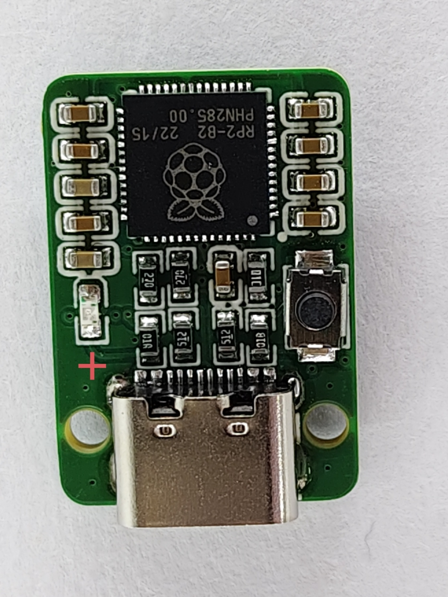
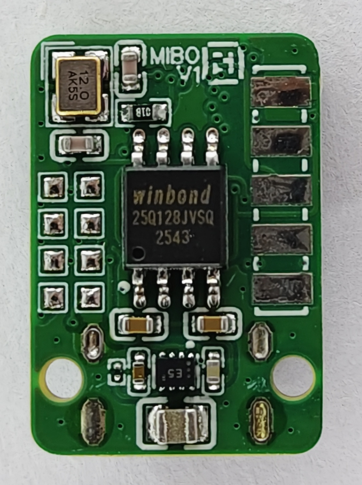

<div align="center">

# MIBO · RP2040

**A thumb-drive-sized, RP2040-based PCB for space-constrained applications.**

[](LICENSE)


</div>

## Overview

MIBO is a minimal, compact **RP2040** board built to fit into space where a normal dev board won't — roughly the footprint of a USB thumb drive. The core board stays deliberately simple and stable; extra functionality is meant to be added later via external shields connected through pogo pins.

## Features

| | |
|---|---|
| **MCU** | Raspberry Pi RP2040, dual-core Cortex-M0+ |
| **Flash** | Winbond W25Q128JVSIQ — 16 MB (128 Mbit) SPI flash |
| **Power** | TI TPS62840 buck converter |
| **Host connection** | USB-C |
| **Clock** | 12 MHz crystal |
| **I/O** | Boot/user button, status LED, 8× GPIO test points |
| **Form factor** | ~USB thumb drive sized |

## Gallery

<div align="center">


</div>

## Repository structure

```
MIBO-RP2040/
├── MiBo_RP2040-v1.uf2         # Pre-built firmware image
└── main/
    ├── schematic/              # Circuit schematics (PDF)
    ├── hardware/                # Gerbers, BOM, Pick & Place files
    ├── pictures/                # Photos & renders of the PCB
    └── README.md                # Hardware documentation
```

## Getting started

Flash the pre-built firmware onto a MIBO board:

1. Hold the **BOOT** button while plugging the board into your computer via USB-C — it enumerates as a mass storage device.
2. Drag and drop [`MiBo_RP2040-v1.uf2`](MiBo_RP2040-v1.uf2) onto the drive.
3. The board reboots automatically and runs the new firmware.

## Hardware files

| File | Description |
|---|---|
| [`RP2040 MiBo V1.0.pdf`](<main/schematic/RP2040 MiBo V1.0.pdf>) | Circuit schematic |
| [`Gerber_RP2040_PCB_RP2040_2026-04-09.zip`](<main/hardware/Gerber_RP2040_PCB_RP2040_2026-04-09.zip>) | Manufacturing (Gerber) files |
| [`BOM_RP2040_2026-04-09.csv`](<main/hardware/BOM_RP2040_2026-04-09.csv>) | Bill of materials |
| [`PickAndPlace_PCB_RP2040_2026-04-09.csv`](<main/hardware/PickAndPlace_PCB_RP2040_2026-04-09.csv>) | Pick & place data |

More detail in [`main/README.md`](main/README.md).

## Status

Currently in early development (**V1 prototype stage**). The core board is meant to stay minimal, with future expansion handled via external shields over pogo pins.

## License

Released under the [MIT License](LICENSE).
